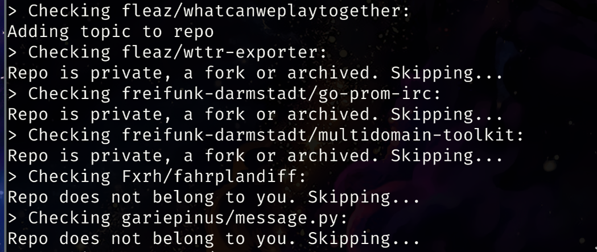

# hacktoberfest-tagger
Quickly add/remove the 'hacktoberfest' topic to all your public repositories


## Motivation
Due to too much SPAM, participation in the Hacktoberfest is now opt-in. That means that you (as a maintainer) have to
add the "hacktoberfest" topic to your repositories before the PRs will count for contributors.  Because most private
accounts will probably not be affected this much by spam, I created this tool to quickly add/remove the topic to all
your public repositories on GitHub.

## Prerequisites
First you need to go to the [Github developer settings](https://github.com/settings/tokens) and create a personal
access token with the `public_repo` permission. The benefit of this in contrast to using your username&password is that
the script only has the permissions it needs, and it also works when you have 2FA enabled (which you definitely should! ;)
) Then you need to install the "PyGithub" library. With pipenv installed you can run `pipenv install` in the repository
folder to create a new virtual environment with all dependencies. When you want to use pip, run `pip install --user
pygithub`.

## Usage
```
./run.py --help
usage: run.py [-h] [--dry-run] {add,remove}

Quickly add/remove the 'hacktoberfest' topic to all of your public Github projects

positional arguments:
  {add,remove}  'add' or 'remve' the topic

optional arguments:
  -h, --help    show this help message and exit
  --dry-run     Don't actually modify the topics
```
